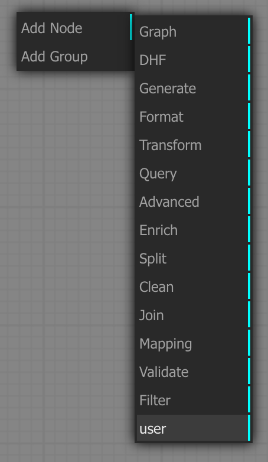

# User defined (custom) blocks

In order to define your own blocks without having to modify and build the front-end you can just update the following 2 files:

./Examples/CustomModules/user.json
./Examples/CustomModules/user.sjs

## Block interfaces definition: It's used to display the block and its inputs/outputs

**./Examples/CustomModules/user.json**

Add a new block definition in the array like this:

```
{
  "functionName": "MyFunction", //Name of the function of the block
  "blockName": "MyFunction", //Name if the block
  "library": "user",  //Name of the menu entry
  "inputs": [.   //List of inputs
    {
      "name": "myInput1",
      "type": null
    }
  ],
  "outputs": [ //List of outputs
    {
      name: "myOutput1",
      type: null
    }
  ],
  "function": {
    "ref": null,
    "code": ""
  }

}
```

## Block implementation : 
It's used to execute the logic of the block in MarkLogic

The code is located in :

**./Examples/CustomModules/user.sjs**

```
function myBlock() //Any unique function is the module
{
   this.addInput("MyInput1"); //Add Inputs, same as the one in the son definition
   this.addOutput("myOutput1");//Add Outputs, same as the one in the son definition
}

myBlock.title = "MyFunction";
myBlock.desc = "MyFunction";

myBlock.prototype.onExecute = function()
{
   let myInput1 = this.getInputData(0) //Add Outputs, same as the one in the son definition
   // Code any logic you want or call external lib
   // Code any logic you want or call external lib
   // Code any logic you want or call external lib
   this.setOutputData(0, outputValueFromLogic ) //Set output(s) value(s)
}
LiteGraph.registerNodeType("user/MyFunction", myBlock ); //The first parameter must be equal to library/blockName of the block definition.
```

You must then run gradle mlloadmodules
You can also find details on block implementation here: [Litegraph guides](https://github.com/jagenjo/litegraph.js/tree/master/guides)


<a name="use-custom-blocks"></a>
## How to tell Pipes to use these blocks

- Put these files in a separate directory. Don't put them in the src/ directory of your DHF project. For instance, if your DHF project is in
```/usr/dev/my-dhf-project```, create a folder
```/usr/dev/my-dhf-project/user-modules``` and put the files there
- Now, to tell Pipes you want to include the user blocks defined in these files, you have to use the ```customModulesRoot``` property. There are 2 ways to do it:
  - ```java -jar marklogic-pipes-1.2-release.jar --customModulesRoot=/usr/dev/my-dhf-project/user-modules```
  - Or, put ```customModulesRoot=/usr/dev/my-dhf-project/user-modules``` in application.properties. The application.properties file should be put in the same folder from which you're running the Pipes jar so that it can be read in on start.
- In the Pipes blocks menu, you should now see a "user" group. If you don't see it, you probably have to refresh your browser or even clear the browser history:


