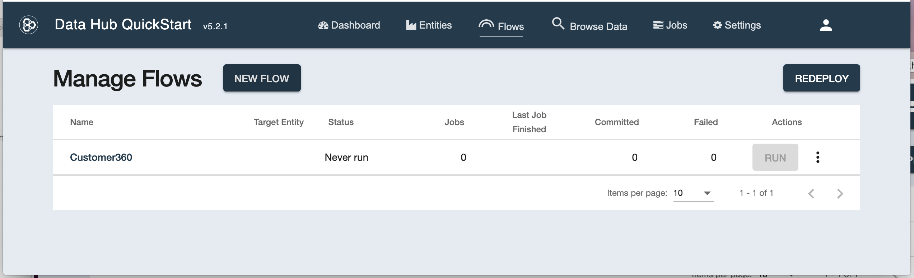

# How Do I Use It?

## Define the entities model in DHF

Pipes creates custom step code for your MarkLogic DataHub flows.

Let's create a custom code which will read in sample customer records and produce instances of Customer and Address entities, based on this data.

As a basis, we'll use a sample DHF project defined in [Examples/Customer360](https://github.com/marklogic-community/pipes/tree/master/Examples/Customer360).

If we deploy this project on a MarkLogic server and run DHF QS UI, we'll see the definition of Customer and Address entities, like below:

The Customer360 project already comes with pre-defined flow and steps so you can skip ahed to [Ingest Data](#Ingest-Data)

## Create the flow

Now that we have the data model defined, let's create a flow to ingest data and transform it using a custom step created with Pipes.

In the DHF QuickStart, click on the Flows tab and then on the "NEW FLOW" button. Create a flow called Customer360. You should see this:

## Add ingest and custom steps

Now click on the flow name (Customer360) to go into the flow definition. It will be empty and look like this:

Now, let's add an Ingest step. Click on "NEW STEP" and define the step as shown in the picture below:

When you clean on "SAVE", you should see this:

Configure the Source Directory Path to the folder that contains the MOCK_DATA.csv file. Set "Delimited Text" as Source Format, Field Separator is "," and Target Format should be "JSON".

Let's add a custom step now. As before, click on "NEW STEP" and define a Custom (type: Other) step.

Let's name it "customer-address-custom", and select "Customer-Source" as the Source Collection. Select "Customer" or "Address" as the Target Entity:

Click on save and you will see:

## Ingest data

Click on the "RUN", deselect the "customer-address-custom" checkbox and click the "RUN" button.

Once the ingest finishes, click on the "Browse Data" tab to check that the data has been ingested as expected. You should see 1000 documents in the "customer-source" collection:

Congratulations, you've ingested data into MarkLogic. Now, let's transform it with Pipes.

## Build a graph in Pipes for the custom step using ingested data

### Log in

Assuming that Pipes is running on localhost and port 9085, open http://localhost:9085 in your browser and log into Pipes:

Enter the username and password of one of the DHF users (such as flow-developer or flow-operator) and, after logging in, you should see:

The biggest part of the UI is taken by the canvas. On the canvas we can see 2 blocks. **Any Pipes graph we build must contain these blocks**.

### **Custom Step Input** block:

This block represents the input to the custom step we're designing here. As the input into the custom step, we specified collection "Customer-Source" as we were defining the custom step in the DHF QuickStart. The Custom Step Input block has 3 nodes on the right side. That means it provides 3 different things:

- **input**: Provides the content of the document(s) in the "Customer-Source" collection. That's the content we will be transforming in the graph into our data model entities.

- **uri**: provides the URI of the incoming document. This can be useful for storing provenance information, for instance.

- **collections**: provides the collections of the incoming document as an array. This, too, is a useful provenance information that can be passed down into the final data model.

### **Custom Step Output** block

This block represents the content that will be generated by the custom step. Everything we feed into it's output node will be outputed by the custom step.

### The minimal graph and running the graph preview

Let's connect these 2 blocks: click and hold the left mouse button on the **input** node

## Save the custom step code from Pipes into the DHF project

## Run the custom step

