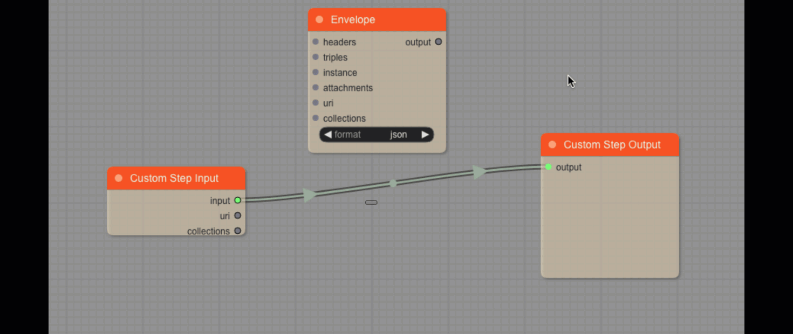

# How Do I Use It?

## Define the entities model in DHF

Pipes creates custom step code for your MarkLogic DataHub flows.

Let's create a custom code which will read in sample customer records and produce instances of Customer and Address entities, based on this data.

As a basis, we'll use a sample DHF project defined in [Examples/Customer360](https://github.com/marklogic-community/pipes/tree/master/Examples/Customer360).

If we deploy this project on a MarkLogic server and run DHF QS UI, we'll see the definition of Customer and Address entities, like below:

The Customer360 project already comes with pre-defined flow and steps so you can skip ahed to [Ingest Data](#Ingest-Data)

## Create the flow

Now that we have the data model defined, let's create a flow to ingest data and transform it using a custom step created with Pipes.

In the DHF QuickStart, click on the Flows tab and then on the "NEW FLOW" button. Create a flow called Customer360. You should see this:

## Add ingest and custom steps

Now click on the flow name (Customer360) to go into the flow definition. It will be empty and look like this:

Now, let's add an Ingest step. Click on "NEW STEP" and define the step as shown in the picture below:

When you clean on "SAVE", you should see this:

Configure the Source Directory Path to the folder that contains the MOCK_DATA.csv file. Set "Delimited Text" as Source Format, Field Separator is "," and Target Format should be "JSON".

Let's add a custom step now. As before, click on "NEW STEP" and define a Custom (type: Other) step.

Let's name it "customer-address-custom", and select "Customer-Source" as the Source Collection. Select "Customer" or "Address" as the Target Entity:

Click on save and you will see:

## Ingest data

Click on the "RUN", deselect the "customer-address-custom" checkbox and click the "RUN" button.

Once the ingest finishes, click on the "Browse Data" tab to check that the data has been ingested as expected. You should see 1000 documents in the "customer-source" collection:

Congratulations, you've ingested data into MarkLogic. Now, let's transform it with Pipes.

## Build a graph in Pipes for the custom step using ingested data

### Log in

Assuming that Pipes is running on localhost and port 9085, open http://localhost:9085 in your browser and log into Pipes:

Enter the username and password of one of the DHF users (such as flow-developer or flow-operator) and, after logging in, you should see:

The biggest part of the UI is taken by the canvas. On the canvas we can see 2 blocks. **Any Pipes graph we build must contain these blocks**.

### **Custom Step Input** block:

This block represents the input to the custom step we're designing here. As the input into the custom step, we specified collection "Customer-Source" as we were defining the custom step in the DHF QuickStart. The Custom Step Input block has 3 nodes on the right side. That means it provides 3 different things:

- **input**: Provides the content of the document(s) in the "Customer-Source" collection. That's the content we will be transforming in the graph into our data model entities.

- **uri**: provides the URI of the incoming document. This can be useful for storing provenance information, for instance.

- **collections**: provides the collections of the incoming document as an array. This, too, is a useful provenance information that can be passed down into the final data model.

### **Custom Step Output** block

This block represents the content that will be generated by the custom step. Everything we feed into it's output node will be outputed by the custom step.

### The minimal graph and running the graph preview

Let's connect these 2 blocks: click and hold the left mouse button on the **input** node of the _Custom Step Input_ block, move it to the **output** node of the _Custom Step Output_ block and release the mouse button there.

Great job.
As we build our graph, we can always preview its output. We do that by doing following:

- In the top bar menu, click on the "Play" button
- The "Preview Graph Execution" wizard will open
- The wizard requires to know which database and collection to use as a source. Since we've already defined our Custom Step in the QuickStart UI, we can select the "Custom DHF Step" option and click on "Continue"
- In the drop-down, we'll select the our custom step "customer-address-custom" (we defined it earlier 👆)
- We'll also check the "Random document" checkbox. This will allow us to execute the preview multiple times, each time using another document as the source
- Click "Continue"
- On the "Save result to Database?" question, we'll leave the checkbox unchecked and click "Continue"

Now, we'll see a summary of our selection:

The source database and collection have been determined based on the information in the custom step.

Click on "Execute Preview" and scroll down to check the results. Notice that the graph produced the input document at its output. This is because we didn't define any transformation yet but simply connected the input with the output. 

Click again on "Execute Preview", scroll down to check the result and notice that another source document was used. This is the result of the "Random Document" checkbox. If we uncheck that, we'll be getting the same source document each time we click on "Execute Preview". This can be useful when we're developing the graph and want to understand how the output has changed since the last time we ran the preview.

Here's the summary of our actions in an animated GIF:

### Add envelope

- Hover over an empty place on the canvas and right-click
- Now, left-clich on the "Add Node"
- Left-click on the "DHF" group and another sub-group will open
- Left-click on "Evelope.
- The Envelope block will appear on the canvas

When creating data hub with MarkLogic using the Data Hub Framework, we  use the envelope data pattern to group data and meta-data together. The Enevelope block in Pipes enforces this pattern.

As we build our graph, we will be directing our data into the Envelope nodes.

Let's connect the Evenlope into the graph.

- Click the **output** node of the _Custom Step Output_ block to lose the connection
- Connect the **output** node of the _Envelope_ to the **output** node of the _Custom Step Output_
- Connect the **input** node of the _Custom Step Input_ to the **instance** node of the _Envelope_

That's it, we're now producing an envelope at the output of our custom step. Run the preview to see how the output has changed.

### Create Entity blocks

The data model is defined by the entities and their relationships we created in the QuickStart UI. Let's create blocks that represent the DHF Entities in Pipes.

- In the upper-left corner, click on the "Setting and Block Creation button"
- Click on the "ENTITY BLOCKS" tab
- In the drop-down, select "Customer"
- The properties of the Customer Entity, as defined in QuickStart UI, will be shown
- Click on "CREATE ENTITY BLOCK"
- Do the same for the Address entity by selecting it in the drop-down and clicking on the "CREATE ENTITY BLOCK" button

### Create source blocks

### Map values

## Save the custom step code from Pipes into the DHF project

## Run the custom step

